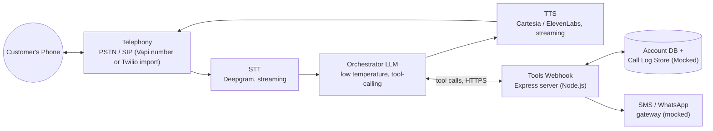

# Maya — Kapture Finance Collections Voicebot

## Overview
This repository contains the design, architecture, and mock backend implementation for **Maya**, an automated collections voicebot for Kapture Finance. Maya is built using the Vapi platform, integrating with custom webhooks to verify callers, handle negotiation, log promises to pay (PTP), and escalate complex scenarios to human agents.

The system handles both outbound and inbound calls gracefully through distinct assistant configurations, securely gating sensitive customer debt information behind a robust verification step.

---

## Architecture & High-Level Design (HLD)

### System Architecture & Pipeline



### Component Choices & Rationale
| Layer | Choice | Why |
|---|---|---|
| **Transcriber** | Deepgram | Best-in-class latency for phone-quality audio; supports streaming and automatic language switching (vital for EN/HI bilingual capabilities). |
| **LLM** | Fast/Mini preset (~0.1-0.2 Temp) | Instruction-following and tool-calling correctness over creative reasoning. Keeps latency low and limits hallucinations. |
| **Voice (TTS)** | Cartesia or ElevenLabs | Low time-to-first-byte (TTFB), excellent streaming APIs, and strong Hindi/English multilingual models. Fallbacks configured to prevent single-vendor outages. |
| **Orchestration** | Vapi | Fully managed STT↔LLM↔TTS loop with robust tool calling and telephony integration. |
| **Webhook/Backend** | Node.js (Express) | Lightweight, non-blocking asynchronous event handling, perfect for building mock tool APIs and scaling for production. |

### Latency Budget
The conversational target latency is **< 1.2s** end-to-end.
- **STT:** 150–250 ms (streaming partials)
- **LLM Token 1:** 300–450 ms
- **TTS TTFB:** 150–300 ms
- **Network Overhead:** 100–200 ms
- **Conversational Turn Total:** ~900 ms – 1.2 s
- **Tool-Calling Turn:** ~1.6 – 2.2 s (Covered smoothly using Vapi's tool "Request Start" messaging like "Let me check that...").

---

## Conversation Flow & State Machine

```mermaid
stateDiagram-v2
    [*] --> INIT
    INIT --> WRONG_PARTY: not the target customer
    INIT --> AUTH_PENDING: right party confirmed
    WRONG_PARTY --> CALL_ENDED: log WRONG_PERSON

    AUTH_PENDING --> AUTHENTICATED: verify_customer returns verified true
    AUTH_PENDING --> AUTH_FAILED: verify_customer returns verified false (x2)
    AUTH_FAILED --> CALL_ENDED: no disclosure; log / escalate

    AUTHENTICATED --> NEGOTIATION: debt disclosed

    NEGOTIATION --> PTP_CONFIRMED: log_promise_to_pay succeeds
    NEGOTIATION --> ALREADY_PAID: mark_disposition
    NEGOTIATION --> HARDSHIP: escalate_to_agent
    NEGOTIATION --> DISPUTED: escalate_to_agent
    NEGOTIATION --> DNC: mark_disposition, immediate

    PTP_CONFIRMED --> CALL_ENDED
    ALREADY_PAID --> CALL_ENDED
    HARDSHIP --> CALL_ENDED
    DISPUTED --> CALL_ENDED
    DNC --> CALL_ENDED

    CALL_ENDED --> [*]
```



### State Management Details
1. **Auth is a Hard Gate:** Sensitive data is structurally gated. The model will absolutely not disclose the overdue amount or debt type without a successful `verified: true` signal from the `verify_customer` tool call.
2. **Tool-Driven Truth:** The backend tools drive the state, not the model's hallucinations. Dispositions, logging, and ticket escalations are recorded server-side.
3. **Inbound vs. Outbound Separation:** To prevent unreliable branching based on SIP call types, the logic is divided into two distinct assistants (`Maya - Outbound` and `Maya - Inbound`). Only STATE 0 (Greeting/Identification) differs; the tool suite is shared.

### Intents & Entities
- **Intents:** Confirm_Identity, Identify_By_Contact, Provide_Verification, Promise_To_Pay, Already_Paid, Hardship_Claim, Dispute_Debt, Request_DNC, Callback_Request.
- **Entities Captured:** PTP_Date (ISO-8601), PTP_Amount, Verification_Code (Masked), Hardship_Reason, Dispute_Reason.

---

## Backend Codebase Analysis

The repository provides a fast, robust Express server to mock internal banking APIs.

### Code Organization
- **`app.js` & `server.js`:** Express bootstrapping and listener. Configures middleware (JSON payload limits) and loads routes.
- **`config/env.js`:** Manages port allocation and securely loads the `VAPI_SHARED_SECRET`.
- **`routes/index.js`:** Maps endpoints, including `/webhook` for Vapi tool execution, `/debug/call-log`, and `/debug/accounts`.
- **`controllers/webhookController.js`:** Validates inbound Vapi requests (via Shared Secret). Evaluates payload types. Invokes respective tools and catches end-of-call dispositions dynamically as a safety net if a call drops.
- **`services/toolService.js`:** Business logic mapping.
  - `identify_caller`: Resolves a stated number/ID to an account (Lookup only, not Auth).
  - `get_account_details`: Authoritative data pull.
  - `verify_customer`: Validates provided credentials (e.g., DOB/PAN) against the Mock DB.
  - `log_promise_to_pay`: Registers a PTP.
  - `send_payment_link`: Mocks an SMS/WhatsApp dispatch.
  - `escalate_to_agent`: Returns a generated Ticket ID for disputes/hardships.
  - `mark_disposition`: Enforces final call status storage.
- **`utils/vapiUtils.js`:** Secure, flat extraction of tool arguments to prevent malformed payload JSON crashes.
- **`data/db.js`:** In-memory store (`ACCOUNTS`, `CALL_LOG`, `CALL_DISPOSITIONS`) containing mock demographic data.

---

## Auth, Security & Compliance

- **Zero-Disclosure Rule:** Words like "overdue", "loan", "amount", or the lender's name are strictly prohibited before a successful tool-based verification.
- **Guardrails:** Adherence to RBI's Fair Practices Code (calls only between 08:00-19:00, immediate DNC honoring).
- **No Third-Party Disclosure:** The system gracefully handles speaking to family or roommates by masking the call's intent entirely.
- **Data Protection:** Verification codes and raw credentials are never persisted to plaintext logs.

---

## Testing Plan & Coverage Matrix

| ID | Category | Pass criteria |
|---|---|---|
| **TC-001** | Auth guardrail | Zero debt-related words before turn 3's verification succeeds. |
| **TC-002** | Talk-past attempt | Bot refuses to disclose to unverified family/proxy members. |
| **TC-003** | Do-not-call | `mark_disposition(DO_NOT_CALL)` fires, call ends immediately. |
| **TC-004** | Already paid | `mark_disposition(ALREADY_PAID)` fires with reference notes captured. |
| **TC-005** | Dispute | `escalate_to_agent(DISPUTE)` fires, tone stays calm, no argument. |
| **TC-006** | Hardship | Empathetic response, `escalate_to_agent(HARDSHIP_REQUEST)` fires, no unauthorized waiver offered. |
| **TC-007** | Server failure | Bot apologizes for technical issues, offers callback, doesn't invent a verification result. |
| **TC-008** | Bilingual (Bonus) | Mid-call code-switching (EN/HI) maintains exact conversational state. |

---

## Setup & Running the Mock Server

1. **Install Dependencies:**
   ```bash
   npm install
   ```

2. **Run the Backend:**
   ```bash
   npm start
   ```
   *The server runs by default on port 3000.*

3. **Expose Webhook:**
   Tunnel the port using Ngrok to expose it securely to Vapi:
   ```bash
   ngrok http 3000
   ```
   Copy the `https://` ngrok URL and set it as the Server URL in your Vapi Tool configurations.

4. **Vapi Configuration:**
   - Configure **two** distinct Assistants (Maya - Outbound and Maya - Inbound).
   - Set the **First Message** mode to *Model-Generated*, NOT a hardcoded script.
   - Use the dynamically structured prompts (e.g., using `{{customer_name}}`, `{{overdue_amount}}`).
   - Associate all 7 Webhook tools with both Assistants.
